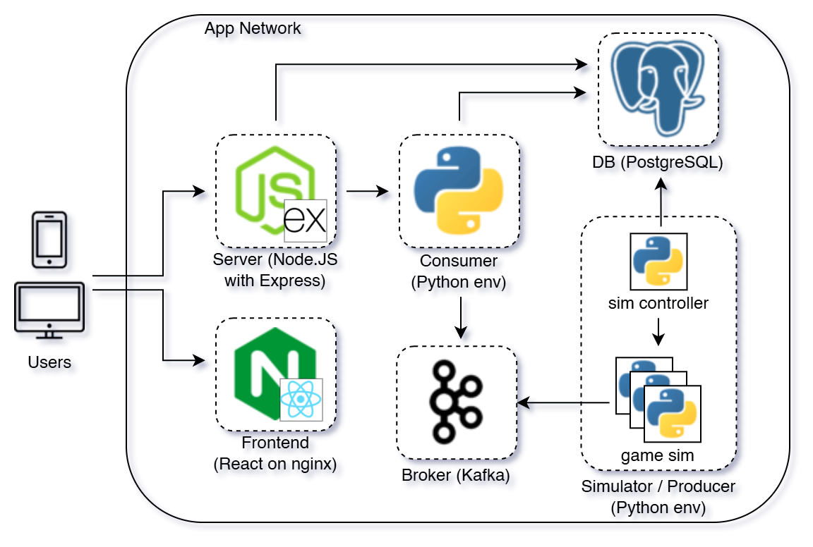

# **Real-Time Sports Data Stream**

---

<!--
### **Tech Stack**
    -- Docker
    -- Apache Kafka
    -- PostgresSQL
    -- Node.js
    -- Express.js
    -- React
    -- Tailwind
    -- Python
    -- Nginx
-->

## Overview  
This project is a distributed system that utilizes Kafka for event-driven communication between services. The architecture consists of a frontend built with React, a backend using Node.js with Express, and a simulation engine powered by Python. The system is containerized using Docker and uses PostgreSQL as the database.  

## Tech Stack  
- **Frontend**: React, Tailwind CSS, Nginx  
- **Backend**: Node.js, Express.js  
- **Message Broker**: Apache Kafka  
- **Database**: PostgreSQL  
- **Simulator**: Python  
- **Containerization**: Docker  

## Architecture  
The architecture consists of multiple components working together:  
- Users interact with the frontend (React, hosted on Nginx).  
- The backend (Node.js + Express) processes requests and communicates with a Kafka consumer.  
- Kafka facilitates event-driven communication between services.  
- A Python-based simulator acts as a Kafka producer, generating events for game simulations.  
- A PostgreSQL database stores relevant data.  
